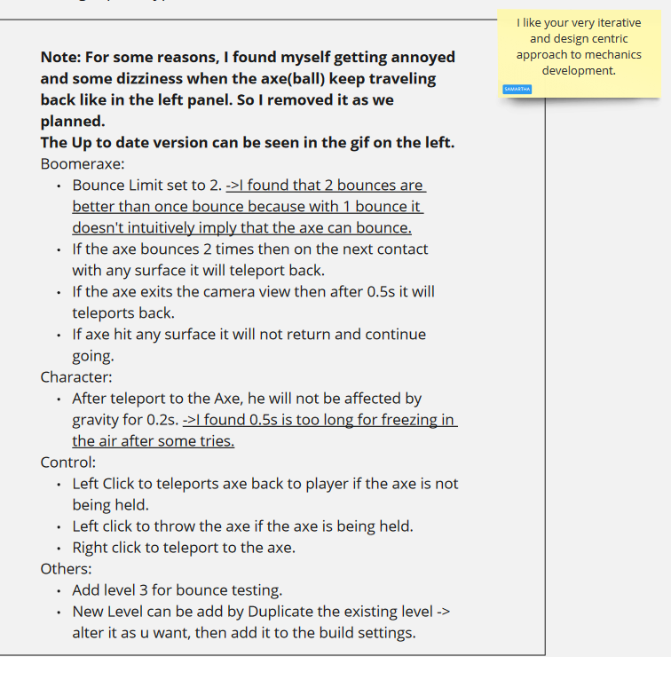
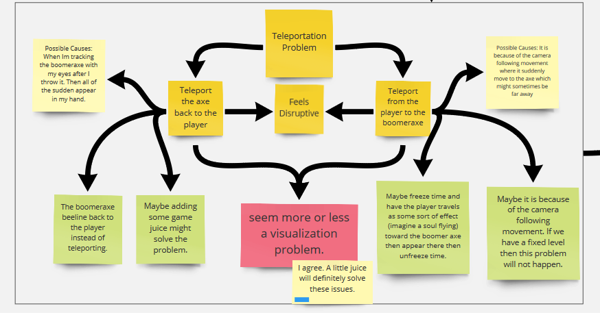
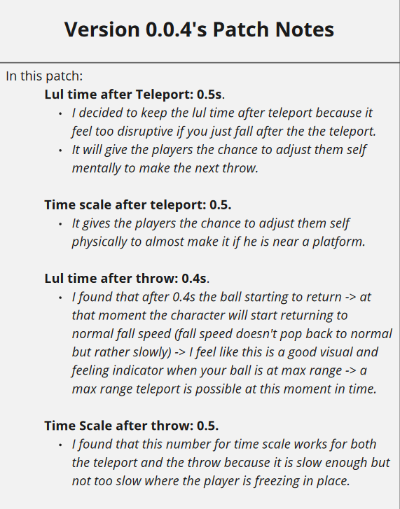
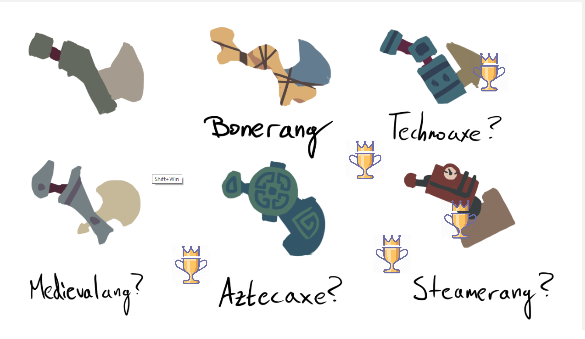

# Tung Cao

_**This is a journal on my thoughts and feelings in this project.**_

---

### __**Ideas Brainstorming(April 16th, 2020 - April 19th, 2020)**__

#### First Thoughts.

In the 2nd prototype, Sam asked me to do the prototype with him and Chris. I found the team's composition to be remarkable. Each of us respect and trust each other in the other skills to a very high respect. With Chris's art skill and Sam's design ability in combining with my programming, I think the team is perfectly suited to any project ... well, any small to medium scale 2D project......

 We all have soft skill in the others' area. For example, Chris and Sam can code. Me and Sam can draw pixel arts, though not as good as Chris. All three of us can do design....  

#### Thoughts on Team Meetings.
Unsuprisingly, we have good dynamic between the three of us since we have been hanging out with each other from the 2nd semester. Our meeting was fun and it feels less like a meeting and more like a group of friend just chatting about the game that they're about to make. 

#### Team's Agreement.

 In the meeting, we agreed that, due to us wanting to somewhat do other design part, it is ideal to have our main job of Programming, Art and Design but we can and probably will help others to do their stuffs if neccessary. If in that week I don't have any programming task left then I probably going help Chris draws some pixel arts. Me and Chris probably going to want to do some design works as well such as Level Design and Narrative Design. So in conclusion, our main job stays and we can work side jobs depend on the week.

 ---

### __**Prototype Making(April 20th, 2020 - April 26th, 2020)**__

#### Planning and fleshing out the core mechanic. 

During the first meeting we went more in-depth into our core game mechanic. We visulized and conceptualized scenarios where and how a player might utilize our game mechanic of throwing the boomeraxe. We also did the same on how would the axe interacts with different examples of levels and environments. Based on that we found some loop holes and exploitation that might happen. 

Also by doing this in-depth analysis, it sped up the implementation process of the boomerax since everything about it, like how would it interacts with the environment, how would it interact with the player, ..., is clearly fleshed out. More on [my note](https://miro.com/app/board/o9J_ktqXOCM=/?moveToWidget=3074457347677901939&cot=6) on the implemntation of the Boomeraxe can be found on the Miro Board.

#### Mechanic development and balancing.
After the first meeting, I went to work on creating the mechanic. As said before it was fast and easy becaus the mechanic is clear from the previous session. Despite that, I found some troubling problems about the mechanics and even more situations that are needed to be discussed in the group. I also did some light game balancing while developing the mechanic and notes it to my teamates.

Though I did found out that the teleportation aspect of the mechanic is quite disruptive in its nature due to the fact that the camera needs to reposition itself to the player.

At the end, however, I concluded that it is a more visual problem than the mechanic itself. 

With that said, however, we did another meeting and concluded that we need a slow down moment after the teleportation due to the fact that if the player starts falling immediately after that. It wouldn't give him/her enough time to aim for the next throw.

I also argued that at the moment of throw the player should be able to move while Sam and Chris argue that the player should be frozen during said time. Their reasons and also mine are valid, as such, we compromised and came up with a different and better solution which it having the player fell that slowly at the throw. Which lead to the next patch.

Later, during the play test of the levels, we aggreed that the changes are for the better of the game.

#### Level Design.

Sam raised an interesting question where he said he had struggle finding more puzzles with the current mechanic. Where I argued that it is not very far-fetch to say we can make about 9 levels with it. As such we planned to do some level designs and compare with each other.

In the next meeting, we concluded that both the bouncing and teleporting mechanic serve the same pupose which is to tranverse the level. However, by having one more than the other, the ways of which the levels can be solved are different. For example, comparing having the boomeraxe bouncing 4 times before disappearing and 1 teleportation and bouncing 2 times and 2 teleportations in solving a level. Which is a really good thing since we can have some sort of a progression system. 

Sam argued that we do have different ways to solve it but it is not unique to that mechanic. For example a player can solve a puzzle by having more teleports or more bounces but there were no design that give a level where it can only be solved by bouncing.

We then concluded that it is possible to have unique puzzle to a certain mechanic by adding elements in the game that only said mechanic can interact with. Like throwing a boomeraxe such that it bounces and hit a button or teleport to a surface where the boomeraxe hit and stuck there.

#### Aesthetic

We also planned and talked about what kind of aesthetic that we can have in the game. Chris, our chief artist, drew some axes with different art style for us to choose and pick from.  

We choosed the aztec version due to it being the most intersting. Then Sam raised a brilliant idea of kind of merging different aesthetics together. Like the Dwarven in skyrim and endless legends where they combined the steam punk machine with a diffrent kind of art.

At the time that I wrote this, Chris is still combining and finding arts for said purpose. I am sure, Chris will write in a more accurate about said process in his journal. 

 ---

### __**Moving Forward (April 27th, 2020 - May 2nd, 2020)**__

We had our first meeting before the prototype session. We talked about how we want to move forward and what we want to have in the next play-test session. I believe that the thing we most aggreed upon was the notion of having autonomous role in the team. Because the three of us at this point had been vision keeper at one point or another and the fact that having someone walking up to us with his task and ask "Is this what you want ?" is not something desirable to have in the group. We don't want someone to be just a mindless developer and we want people to add their own taste and keep asking, adding and questioning about the vision of the game. 

That is why, I object to adding anymore member moving forward. I feel like the current team works because each person can be in controlled of his own role and more. As said in the first section, each of us understand the job of others and ourself which result in us, in meetings, asking more questions like "Is this thing going into the right direction of the vision ?", "Can we steer the direction of the vision this way because of this ?", "I found something really cool that we did not plan which fit the vision. ".

#### Planning and Adapting.

During this meeting, we talked about the bad things and good things from the prototype session. There was too many layers in the core mechanic, we found out. There is the throw, bounce, teleport and it was a bit too much. We decided to strip it down to it core's value which was just the throw. Then we elaborated on how can this "throw" interact with other elements in the game rather than just jam all of the functionalities into the axe.

Sam brought up the design pillar that we learnt from the Creative production class. We decided that Design pillars need to be established. I found that it was a good thing to have since we can easily pointed at the pillars when making decisions during this period.

##### Design pillars

The pillars are Game Juice, Modular and Sprints. To understand what these pillar means, I would like to link that to our Miro Board since I don't want to re-elaborate them here. 

One of the pillar was quite weird for me which is the game juice. Normally, we would only add juice to the game at the last stage and now we're are talking and making decisions on whether a mechanic should be added based on how much we can juice it. However, combined with the sprints pillar where we will live and die by the sprint, it worked out well.

 Basically, in a meeting about the sprint, we would talked as if there is no next week. The game must be at a finished stage after the sprint's period. Which was quite hard because I have to create the mechanic, test it, juice it within one week. Though, I feel like it is in itself very rewarding since it seems like you always have a finished game at the end of the week.

##### The Jungle Gym

Sam brought up an interesting concept where maybe we shoudln't be thinking of only the mechanic in a vaccum. We should think about its core nature and how many interesting interactions it can have. In the end, when all elements are combined together, then that is our toy instead of having one gameplay element being so.

#### Iterations

##### First iteration.
I made 2 different versions of the boomeraxe this week. The first one was tracing boomeraxe where it could just track you down where ever you go. It was by far the most playful. However, i found out that it could only be playful if you are actively playing with it, just like a cat.

So how it works is, when you throw the boomeraxe, it will tracks you down. The problem with this is you don't have the control over it. Which is quite annoying when you are trying to do something else.

Sam wanted to push this iteration to the end of the week but we all agreed that the 2nd iteration is for the better.

##### 2nd iteration.

In this iteration, the axe only tracks you down on command. When you throw the axe, it will stick to any surface then you can recall it. This is not as playful as the 1st or previous interation but if we go back to the idea of the "Jungle Gym", it has the most promises. Due to it being simple in nature, it can has a wild range of interesting interactions with the other elements. They, together, create a jungle gym which result in a more interesting toy.

### __**Moving Forward (May 3rd, 2020 - May 10th, 2020)**__

##### First thought.

I asked prof Csongor about the miro board being the journal itself. It turned out that we also need personal thoughts as well. I, however, do not like mixing works and private matters. Eventhough, everyone can read this journal anyway.

To get to the point, this journal will be less work related like what was done and my processing on accomplishing a certain task, and more just thoughts of what happened. 

##### Playtest Tuesday.

It was dull as hell. No one joined to play our game. There were 11 downloads and some people didn't give any feedbacks. Shame on them!!. 

The axe's fly back motion was real nice but people didn't like it. Oh, well I guess. 

##### Team orngization.

Ousama is being pushed into the team for no real reasons. He has a team that is welcoming him and the just because the he said he doesn't like it, the prof is pushing him into the team. Even though, we clearly stated that we don't like it as well. Does his words matter more ?.

Got Ousama in the team, he will be in charge of testing the limit of the our mechanics. Such as, how many interesting puzzle that can be made out of a set of mechanics.

He made some nice instances where the mechanic can be more than just a puzzle i.e. short-cut, creating a path. Though, I don't think he noticed that he created those features. We, then, give him feedbacks and advices to point him in the right direction.

He took off some of the workloads needed for testing the mechanics beforehand. Which mean we can go into making actual levels sooner, pretty nice.

### __**Level and Narrative Design (May 11th, 2020 - May 19th, 2020)**__

During this sprint, the focus was more about the level and narrative in the game. In meetings, we talked more about those aspect while Chris is working on the new art version and concepting and Ousama is working on more puzzle instances.

I took this time to see the way Ousama creating the levels and improve our unity editor to make the process easier. Which result in this sprint being a quality of life improvment in the Unity editor on coding the side. The changes can be seen in Version 0.1.4.

### __**Level and New tilesets(May 20th, 2020 - May 26th, 2020)**__

There was more thoughts on adding new mechanic to the game but I told them that we won't have the time to polish it to the extend of the current mechanic. I rather keep polishing current mechanics and game feel than making half finish mechanic.

Chris made some amazing tileset art but it is so time consuming to add them into the game. Maybe a better solution can be found in the future.

Ousama also made some pretty good puzzles. Though we talked about what we want from our puzzles. Just because our game are inspired by celeste, that doesn't mean we need to make out level the way they make it. Celeste has an emphasis on their movement, jumping and dashing as their core mechanic. Ours, however, focus more in the the throwing and recalling of the axe. Hence, the level he made so far missed the point but after we talked about it. The levels place a heavier emphasis on the axe which leads to some very interesting results. 

However, his levels are still too convoluted with unncessary elements. Though, I think I can work with his levels to balance it out. Remove unncessary elements and introducing the level's idea slowly to the player.

### __**Bugs fixing and Polishing - Focus on Narrative. (May 27th, 2020 - June 1st, 2020)**__

Nothing much happened this week, just a lot of bug fixing and polishing.

Most of our meetings are about narrative aspect of the game as that is the goal of this week.